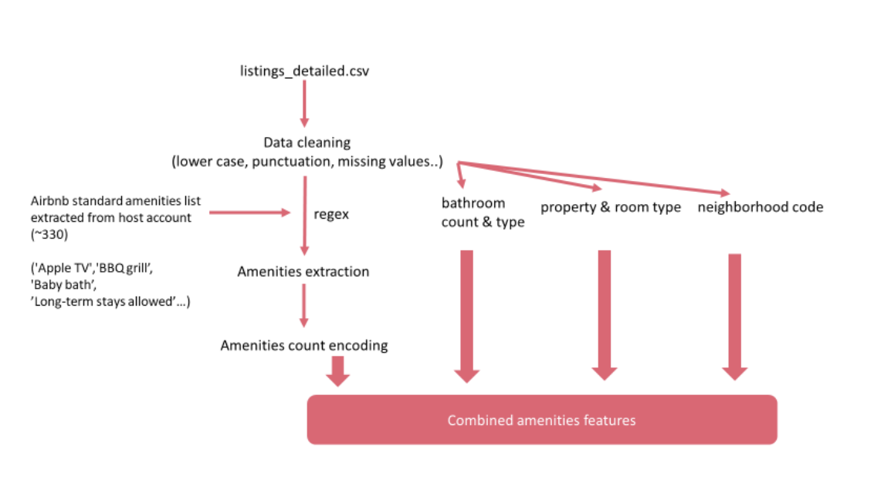
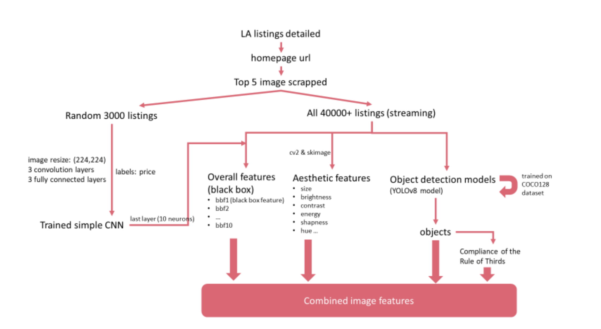
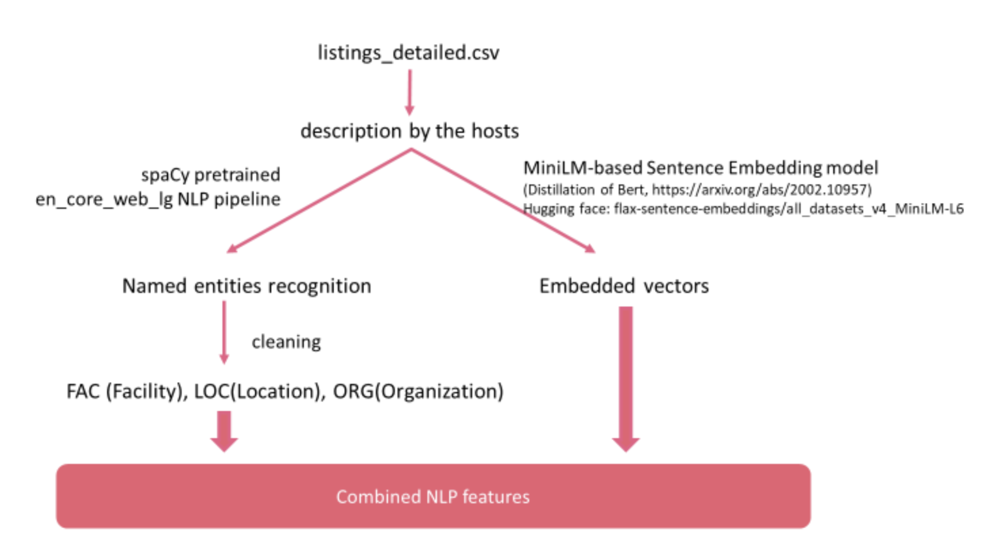

# Capstone_GMT89
- [Installation](#installation)
- [Usage](#usage)
- [Contributing](#contributing)
- [License](#license)

## Project overview

How should I charge my Airbnb listing? Owners typically consider several factors including prices around the neighborhood, the configuration of the property, and the cost of owning and listing the unit. While some systems have provided solutions to a reasonable pricing recommendation, they are either less comprehensive in features input or did not mention the “competitiveness” at that price. This project aims to create a web application to allow users to figure out the optimal price point that is competitive with the market while not undervaluing the property for new property owners looking to list on Airbnb. Besides that, we aim to provide users with further helpful information about why they should charge at this range and what additional features they can include improving their pricing power.

## Dataset

### Airbnb Listings data in Los Angeles
This project focuses on Los Angeles (LA) using data downloaded from Airbnb (http://insideairbnb.com/get-the-data/). LA is one of the most popular locations for property lister and that offers a large dataset and high usability for the final web application of this project The data set contains over 40,000 unique listings with detailed information about the configuration of the properties, amenities, location coordinates, description, price, and more. As our project focuses on the perspective of property hosts, particularly new hosts, only features available at the point of sign-up are utilized.

### “Amenity Universe” dataset
This dataset is a collection of common amenities in Airbnb listings collected by a previous project (Lewis, Data cleaning in Python: examples from cleaning Airbnb data, 2019)

### COCO128 dataset
This dataset contains 128 daily objects and is commonly used for training an object detection model in YOLO (https://github.com/ultralytics/yolov5) series of models.

### RealEstate dataset
This data set is provided by Redfin (https://www.redfin.com/news/data-center/), and house market data is aggregated by Zipcode. This data has been generated monthly since 2000, and up till January 2023 for our model.

## Methodology

The project can be broken down into several broad categories (see flow chart): 
1. Initial exploratory data analysis 
2. Feature engineering (four parts)
3. Supervised machine learning model construction
4. Web app.

## Installation
`pip install -r requirements.txt`

## usage
Version 1.0.0

To run the model:

0. Download the [latest version](https://github.com/foye501/Capstone_GM89/releases)
1. Go to `Project_Airbnb2/Scripts/the_pipelines`
2. `python update_features.py`. This will generate processing pipelines and features that will be utilized in the training.
3. `python train.py`. This will train all five quantile regression LightGBM models, and store them. Other preprocessing like imputation, dimensionality reduction are also involved. 
4. Go to `../Capstone_app`, run `streamline run Home.py` to launch the web application. You can directly go to our web platform: http://18.205.39.151:8502

### Resources
Web application: http://18.205.39.151:8502/my_app

GitHub: https://github.com/foye501/Capstone_GMT89

Report: https://docs.google.com/document/d/161fEv0t4Ops9SG5NPMAXZgnTigGPNvgPrR8gCyeM7x0/

Video explanation: https://www.youtube.com/playlist?list=PL-Ih8lEqwhvFGjcMphHh4x3e4OoW4smun

Poster:

Medium blog: https://medium.com/@chenyk_80392/beyond-a-single-price-pricing-range-improvement-suggestions-for-new-airbnb-hosts-a33ffa718fbb

Airbnb data source: http://insideairbnb.com/get-the-data/

### Overall dataflow

### Amenity Pipeline

### Image Pipeline

### location_pipeline

### NLP_pipeline

### Contributing

- Wei Li Tan: Amenities analysis, final report consolidation
- Yangkang Chen: Image analysis, model consolidation
- Masato Ando: Location analysis, github
- Dongyao Wang: Description NLP analysis, Web application

