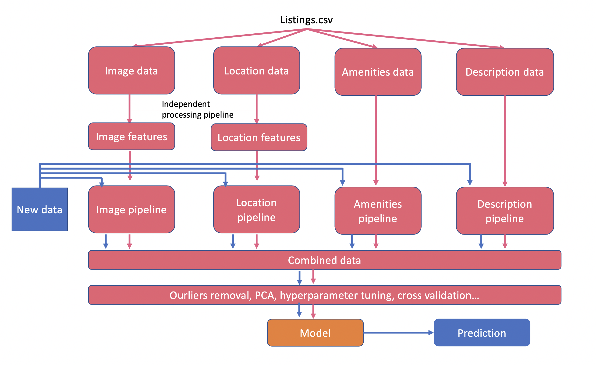

# Capstone_GM89
- [Installation](#installation)
- [Usage](#usage)
- [Contributing](#contributing)
- [License](#license)

## Installation
pip install -r requirements.txt

## usage
### Overall dataflow

### Amenity Pipeline

### Image Pipeline

### location_pipeline

### NLP_pipeline

### Contributing

- Wei Li Tan: Amenities analysis, final report consolidation
- Yangkang Chen: Image analysis, model consolidation
- Masato Ando: Location analysis, github
- Dongyao Wang: Description NLP analysis, Web application

