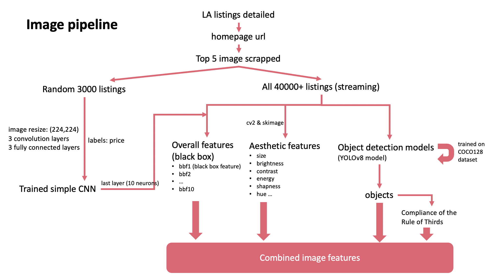

# Capstone_GMT89
- [Installation](#installation)
- [Usage](#usage)
- [Contributing](#contributing)
- [License](#license)

## Installation
`pip install -r requirements.txt`

## usage
Version 1.0.0

To run the model:

0. Download the [latest version](https://github.com/foye501/Capstone_GM89/releases)
1. Go to `Project_Airbnb2/Scripts/the_pipelines`
2. `python update_features.py`. This will generate processing pipelines and features that will be utilized in the training.
3. `python train.py`. This will train all five quantile regression LightGBM models, and store them. Other preprocessing like imputation, dimensionality reduction are also involved. 
4. Go to `../Capstone_app`, run `streamline run Home.py` to launch the web application. You can directly go to our web platform: http://18.205.39.151:8502

### Resources
Web application: http://18.205.39.151:8502/my_app

GitHub: https://github.com/foye501/Capstone_GMT89

Report: https://docs.google.com/document/d/161fEv0t4Ops9SG5NPMAXZgnTigGPNvgPrR8gCyeM7x0/

Video explanation: https://www.youtube.com/playlist?list=PL-Ih8lEqwhvFGjcMphHh4x3e4OoW4smun

Poster:

Medium blog: https://medium.com/@chenyk_80392/beyond-a-single-price-pricing-range-improvement-suggestions-for-new-airbnb-hosts-a33ffa718fbb

Airbnb data source: http://insideairbnb.com/get-the-data/

### Overall dataflow

### Amenity Pipeline

### Image Pipeline

### location_pipeline

### NLP_pipeline

### Contributing

- Wei Li Tan: Amenities analysis, final report consolidation
- Yangkang Chen: Image analysis, model consolidation
- Masato Ando: Location analysis, github
- Dongyao Wang: Description NLP analysis, Web application

